# Resultados de Interpretabilidad

**Script:** `src/04_interpretabilidad.py`

**Modelo analizado:** Random Forest (hiperparámetros optimizados con Optuna, AUC ~0.9691)

## Técnicas Aplicadas

1. **Feature Importance (Gini)** — Incorporada en Random Forest
2. **Importancia por Permutación** — Mide cuánto baja el AUC al desordenar cada variable
3. **SHAP (TreeExplainer)** — Explicaciones a nivel global e individual

## Importancia por Permutación

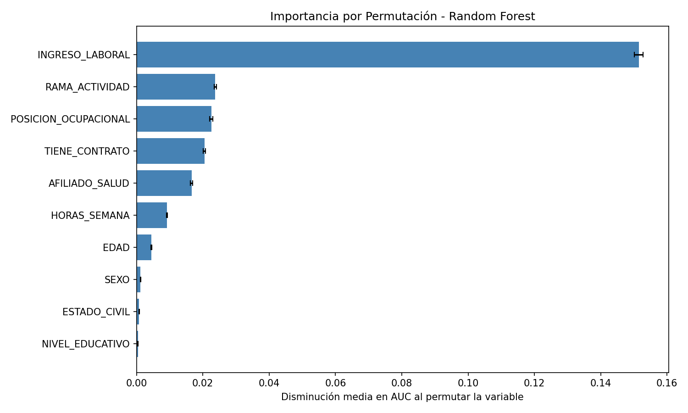

INGRESO_LABORAL domina con una disminución de 0.1515 en AUC al ser permutada, muy por encima de las demás variables.

## SHAP - Análisis Global

### Summary Plot (Beeswarm)

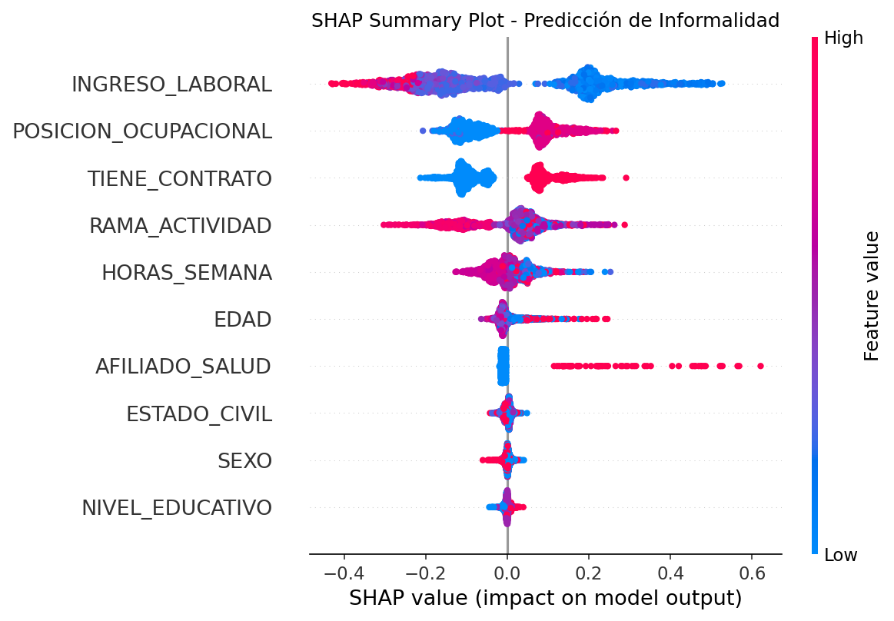

Cada punto representa una observación. El color indica el valor de la variable (rojo = alto, azul = bajo). Las variables aparecen ordenadas por importancia.

### Importancia Global SHAP

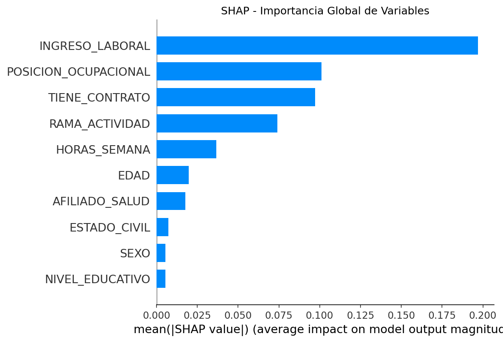

## SHAP - Dependence Plots

Muestran cómo el valor de cada variable afecta la predicción de informalidad.

| INGRESO_LABORAL | POSICION_OCUPACIONAL |
|:---:|:---:|
| 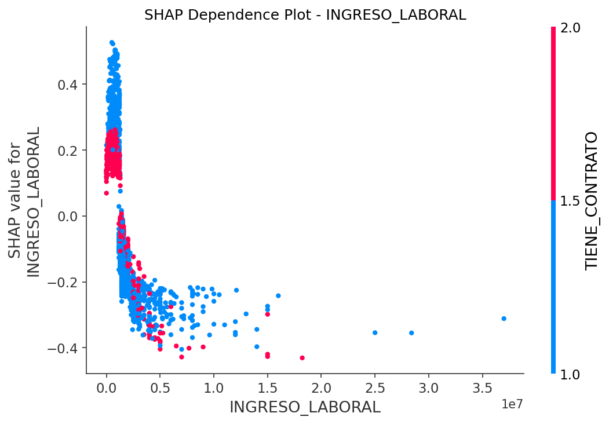 | 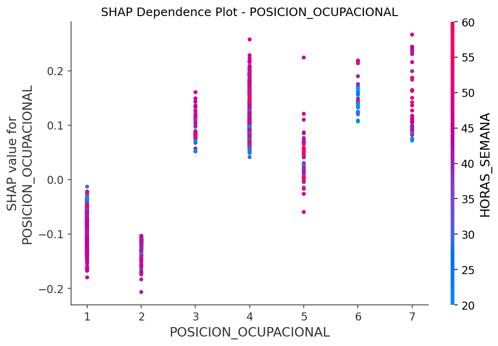 |

| TIENE_CONTRATO | RAMA_ACTIVIDAD |
|:---:|:---:|
| 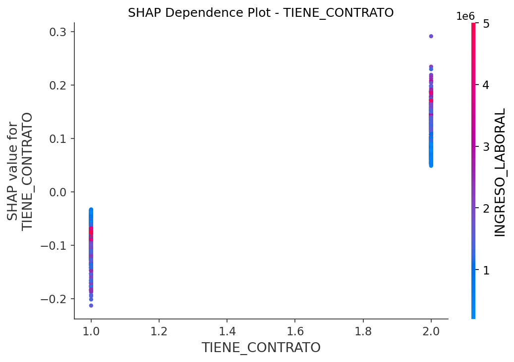 | 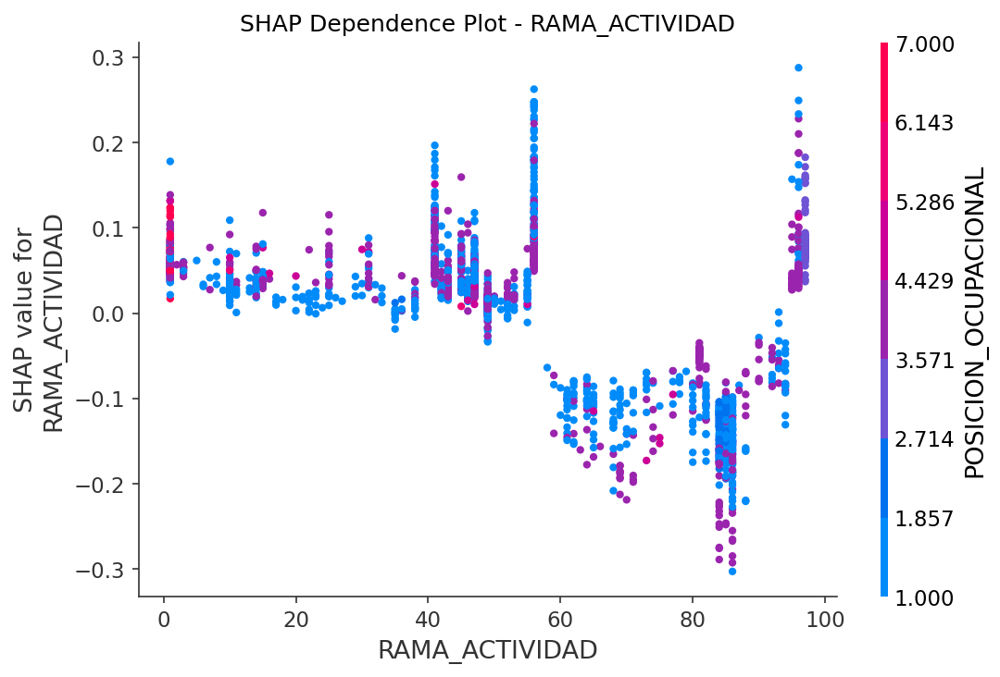 |

## SHAP - Predicciones Individuales

### Trabajador Informal típico (prob > 95%)

Hombre, 22 años, cuenta propia, sin contrato, $500,000, agricultura.

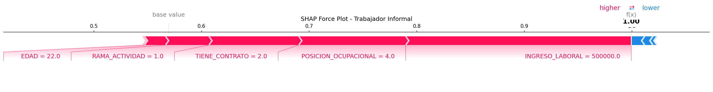

### Trabajador Formal típico (prob < 5%)

Hombre, 37 años, empleado particular, con contrato, $4,000,000, sector profesional.

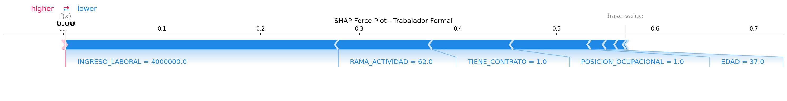

### Nuevo individuo (Mujer, 35, Cuenta propia, $800K)

Predicción: **INFORMAL** (probabilidad: 97.6%)

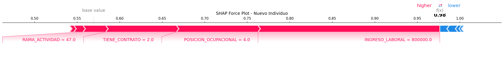

## Comparación de los 3 Métodos

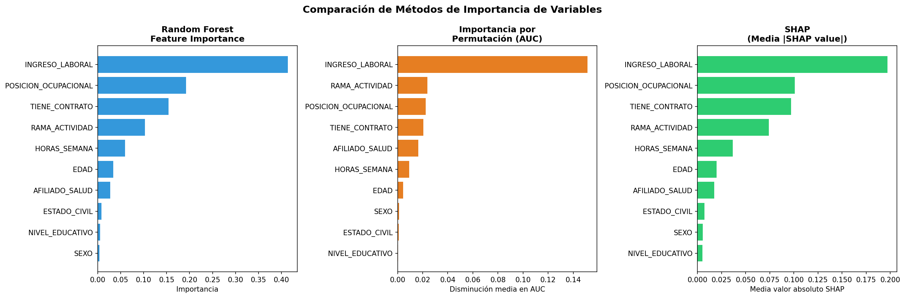

| # | Variable | RF Importance | Permutación | SHAP |
|---|----------|:---:|:---:|:---:|
| 1 | INGRESO_LABORAL | 0.4139 | 0.1515 | 0.1971 |
| 2 | POSICION_OCUPACIONAL | 0.1926 | 0.0225 | 0.1011 |
| 3 | TIENE_CONTRATO | 0.1538 | 0.0205 | 0.0972 |
| 4 | RAMA_ACTIVIDAD | 0.1027 | 0.0237 | 0.0740 |
| 5 | HORAS_SEMANA | 0.0595 | 0.0092 | 0.0367 |

Los tres métodos coinciden en el ranking de las 5 variables más importantes, lo que da robustez a los hallazgos.

## Interpretación

- **INGRESO_LABORAL:** A menor ingreso, mayor probabilidad de informalidad. Es el factor más determinante.
- **POSICION_OCUPACIONAL:** Cuenta propia, jornaleros y trabajadores familiares tienen alta probabilidad de informalidad.
- **TIENE_CONTRATO:** No tener contrato incrementa fuertemente la probabilidad de ser clasificado como informal.
- **RAMA_ACTIVIDAD:** Sectores como comercio y agricultura concentran más informalidad.
- **HORAS_SEMANA:** Trabajar menos horas se asocia con informalidad.
