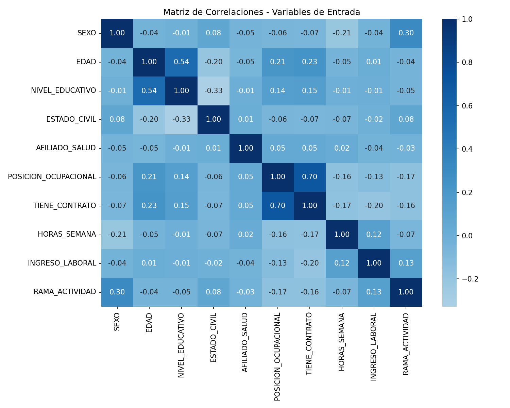
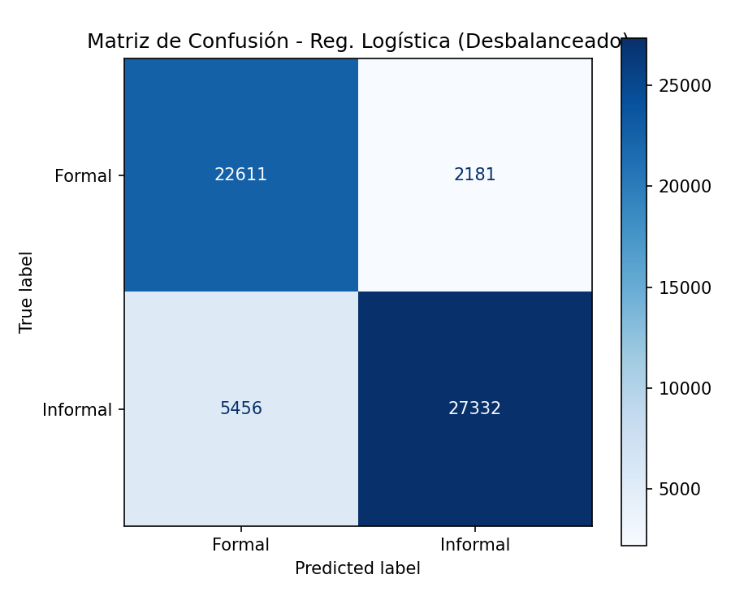
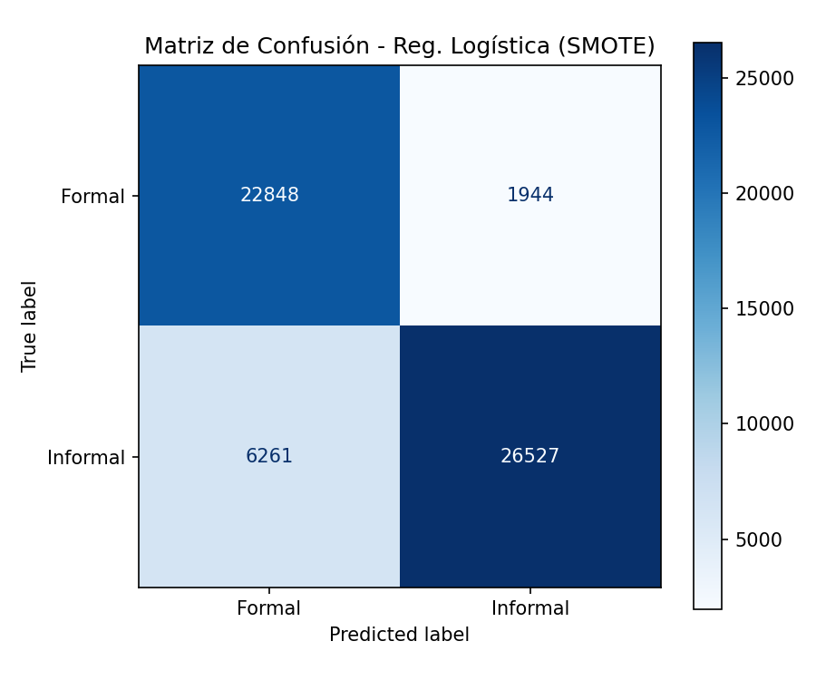
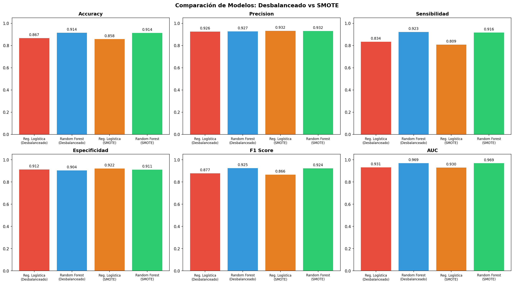
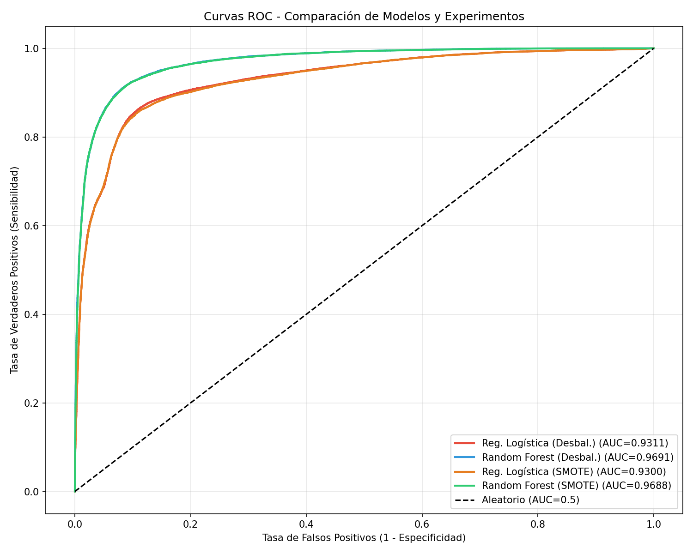
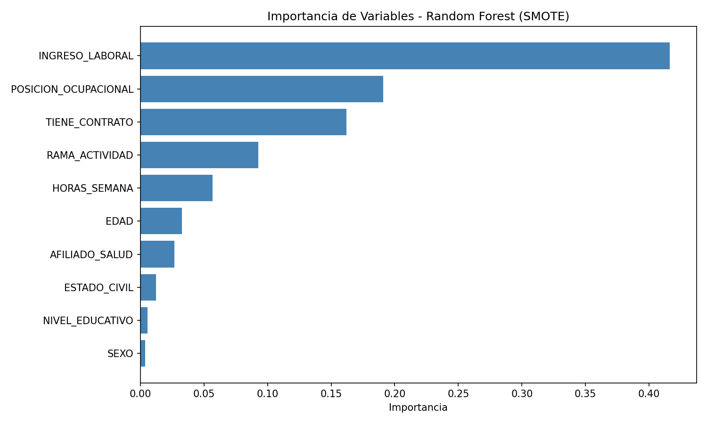

# Resultados de Modelos de Clasificación

**Script:** `src/03_modelos_clasificacion.py`

## Variables

**Predictoras (10):** SEXO, EDAD, NIVEL_EDUCATIVO, ESTADO_CIVIL, AFILIADO_SALUD, POSICION_OCUPACIONAL, TIENE_CONTRATO, HORAS_SEMANA, INGRESO_LABORAL, RAMA_ACTIVIDAD

**Excluidas:** COTIZA_PENSION (define la variable objetivo), INGRESO_MONETARIO (correlación 0.67 con INGRESO_LABORAL), DEPARTAMENTO (demasiadas categorías), MES_PERIODO (no predictora)

**Objetivo:** INFORMAL (0=Formal, 1=Informal)

## Multicolinealidad

La correlación más alta entre features es 0.70 (POSICION_OCUPACIONAL vs TIENE_CONTRATO), aceptable para los modelos utilizados.

## Validación Cruzada (5-Fold Stratified)

| Modelo | AUC Media | Desv. Estándar |
|--------|-----------|----------------|
| Regresión Logística | 0.9311 | ±0.0009 |
| Random Forest | 0.9642 | ±0.0003 |

Ambos modelos muestran alta estabilidad (desviación estándar muy baja).

## Optimización con Optuna (50 trials)

### Regresión Logística
- **C:** 74.58
- **Solver:** lbfgs
- **Mejor AUC (CV):** 0.9311

### Random Forest
- **n_estimators:** 298
- **max_depth:** 26
- **min_samples_split:** 19
- **min_samples_leaf:** 4
- **max_features:** sqrt
- **Mejor AUC (CV):** 0.9699

## Experimento 1: Datos Desbalanceados (sin SMOTE)

Distribución: 131,152 informales vs 99,168 formales (57/43%)

| Modelo | Accuracy | Precision | Sensibilidad | Especificidad | F1 Score | AUC |
|--------|----------|-----------|-------------|--------------|----------|-----|
| Reg. Logística | 0.8674 | 0.9261 | 0.8336 | 0.9120 | 0.8774 | 0.9311 |
| Random Forest | **0.9145** | **0.9268** | **0.9227** | 0.9036 | **0.9247** | **0.9691** |

### Matrices de Confusión

| Regresión Logística | Random Forest |
|:---:|:---:|
|  |  |

## Experimento 2: Datos Balanceados (SMOTE)

Distribución después de SMOTE: 131,152 por clase (50/50%)

| Modelo | Accuracy | Precision | Sensibilidad | Especificidad | F1 Score | AUC |
|--------|----------|-----------|-------------|--------------|----------|-----|
| Reg. Logística | 0.8575 | 0.9317 | 0.8090 | **0.9216** | 0.8661 | 0.9300 |
| Random Forest | 0.9139 | 0.9315 | 0.9162 | 0.9109 | 0.9238 | 0.9689 |

### Matrices de Confusión

| Regresión Logística | Random Forest |
|:---:|:---:|
|  |  |

## Comparación de Experimentos

**Observaciones:**
- Random Forest supera a Regresión Logística en todas las métricas principales.
- SMOTE no mejoró significativamente el rendimiento ya que el desbalanceo era moderado (57/43%).
- La Regresión Logística con SMOTE aumentó su especificidad pero perdió sensibilidad.

## Curvas ROC

## Importancia de Variables (Random Forest)

### Top 5 Variables

| # | Variable | Importancia |
|---|----------|-------------|
| 1 | INGRESO_LABORAL | 0.4163 |
| 2 | POSICION_OCUPACIONAL | 0.1908 |
| 3 | TIENE_CONTRATO | 0.1622 |
| 4 | RAMA_ACTIVIDAD | 0.0927 |
| 5 | HORAS_SEMANA | 0.0569 |

## Predicción de Ejemplo

**Perfil:** Mujer, 35 años, Secundaria, Soltera, Afiliada a salud, Cuenta propia, Sin contrato, 48 horas/semana, $800,000, Comercio

**Resultado:** INFORMAL (probabilidad: 97.7%)

## Conclusión

El mejor modelo es **Random Forest (Desbalanceado)** con un AUC de **0.9691**, optimizado con Optuna. El ingreso laboral es la variable más determinante para predecir informalidad.
